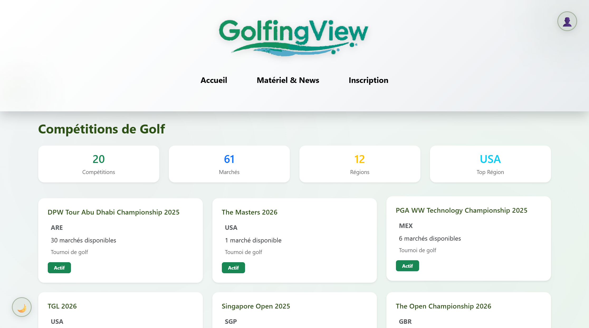
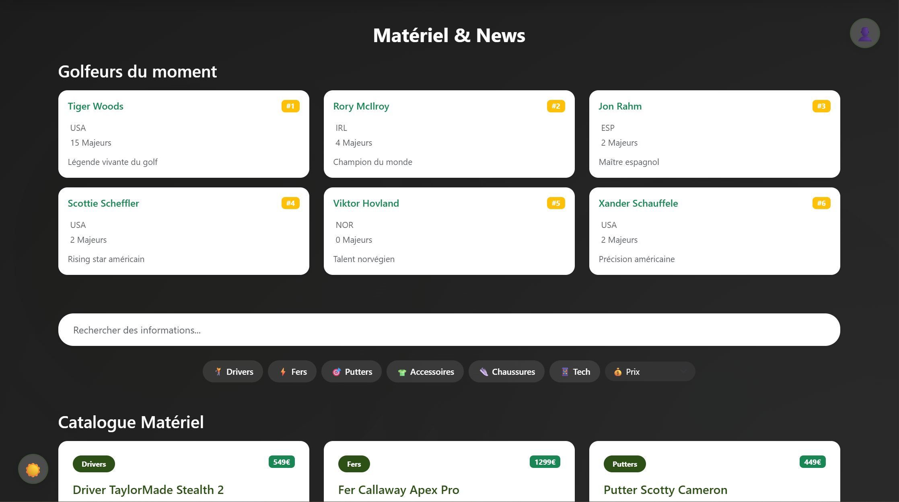
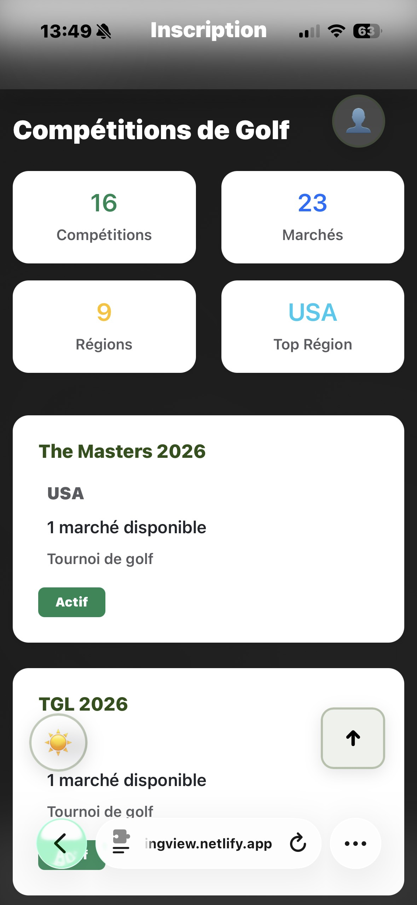
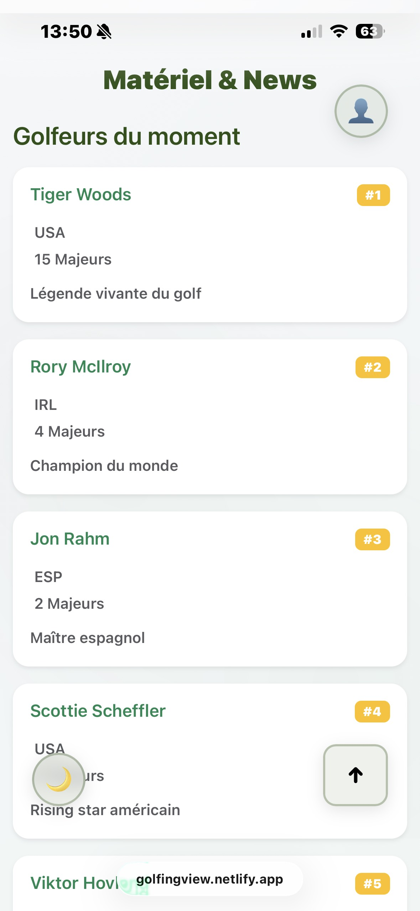

# 📸 Captures d'Écran

## Desktop

### Page d'Accueil

*Page d'accueil - Vue desktop avec compétitions*

### Page Matériel & News

*Page matériel & news - Catalogue et filtres*

## Mobile

### Version Mobile

*Version mobile responsive*

### Menu Mobile

*Menu de navigation mobile*

## Responsive Design
L'application s'adapte automatiquement aux différentes tailles d'écran :
- **Mobile** (< 576px) : Navigation hamburger, cards en colonne unique
- **Tablet** (576px - 992px) : Cards en 2 colonnes
- **Desktop** (> 992px) : Cards en 3-4 colonnes, navigation complète